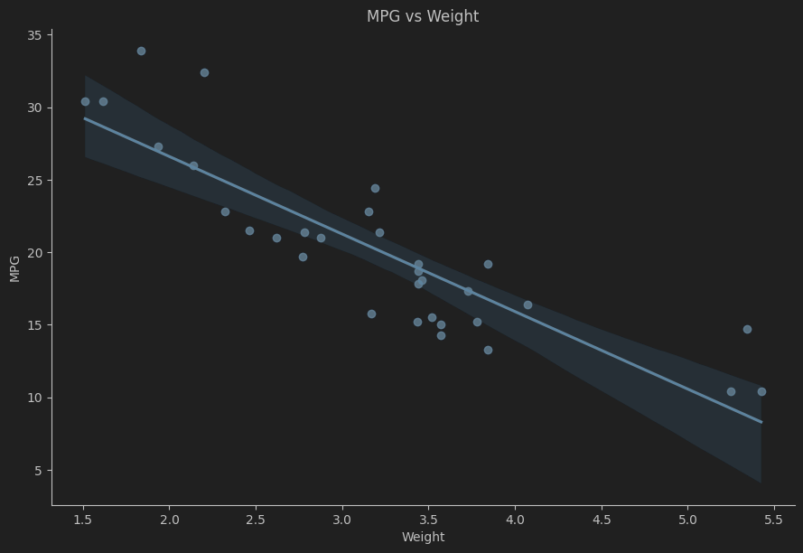

# W1

# W1M1 - mtcars 데이터 분석하기

- 데이터셋의 features에 대한 설명은 다음과 같습니다.
    - mpg = Miles/(US) gallon, 연비
    - cyl = Number of cylinders, 기통
    - disp = Displacement (cu.in.), 배기량
    - hp = Gross horsepower, 마력
    - drat = Rear axle ratio, 뒷 바퀴 축 기어 비
    - wt = Weight (lb/1000), 차량 무게
    - qsec = ¼ mile time, 제로 0.25마일?
    - vs = V/S, 엔진의 형태를 나타내는 이진 변수입니다.
        - **0 = V-모양 (V-shaped) 엔진**
        - **1 = 직선형 (straight) 엔진**
    - am = Transmission (0 = automatic, 1 = manual), 기어 자동/수동
    - gear = Number of forward gears, 전진 기어의 수
    - carb = Number of carburetors,  엔진 내 기화기 수

## 팀 활동 토의 결과

1. 데이터셋을 분석해서 얻을 수 있는 경제적 가치는 무엇일까요? → 소비자에게 자동차 추천할 때!
    
    판매량, 가격과 같은 경제와 직접적으로 연관된 데이터가 없으니 연비를 기준으로 경제적 가치를 설명하는 것을 전제로 한다.
    데이터상으로는 실린더의 개수가 적고, 배기량이 낮고, 무게가 가벼운 차일수록 연비가 높았다.
    따라서, 연비가 높은 차를 생산하는 것이 경제적 가치가 높을 것으로 예상된다.
    
2. 어떤 비즈니스 상황에서 이런 데이터셋을 분석해서 어떤 경제적 가치를 얻을 수 있을까요?
    
    판매량과 가격도 포함된 데이터를 분석할 때, 어떤 자동차를 얼마나 더 생산해야 하는지 수정하여 판매 수익을 높이는 방향으로 경제적 가치를 얻을 수 있다.
    
3. 중요한 데이터인 연비를 기준으로, wt(무게), cyl(실린더 개수), disp(배기량)을 선택했고, 그 중 상관계수가 가장 높은 무게를 그래프로 그려보았다. → 기계적으로 누구나 할 수 있지만, 어느 관점에서 보느냐가 더 중요하다.

```python
# 변수간 상관관계 그래프
# draw a linear regression line between mpg and wt, mpg and cyl, mpg and disp
import seaborn as sns
sns.lmplot(x='wt', y='mpg', data=df, height=6, aspect=1.5)
plt.title('MPG vs Weight')
plt.xlabel('Weight')
plt.ylabel('MPG')
plt.show()

sns.lmplot(x='cyl', y='mpg', data=df, height=6, aspect=1.5)
plt.title('MPG vs Cylinders')
plt.xlabel('Number of Cylinders')
plt.ylabel('MPG')
plt.show()

sns.lmplot(x='disp', y='mpg', data=df, height=6, aspect=1.5)
plt.title('MPG vs Displacement')
plt.xlabel('Displacement')
plt.ylabel('MPG')
plt.show()

# P-value로 상관관계 분석
from scipy import stats
slope, intercept, r_value, p_value, std_err = stats.linregress(df['wt'], df['mpg'])
print(f'P-value of wt and mpg: {p_value}, equation: y = {slope:.2f}x + {intercept:.2f}')
slope, intercept, r_value, p_value, std_err = stats.linregress(df['cyl'], df['mpg'])
print(f'P-value of cyl and mpg: {p_value}, equation: y = {slope:.2f}x + {intercept:.2f}')
slope, intercept, r_value, p_value, std_err = stats.linregress(df['disp'], df['mpg'])
print(f'P-value of disp and mpg: {p_value}, equation: y = {slope:.2f}x + {intercept:.2f}')
```

- 출력 결과
    
    
    
    
    
    
    
    P-value of wt and mpg: 1.2939587013504974e-10, equation: y = -5.34x + 37.29
    P-value of cyl and mpg: 6.112687142580981e-10, equation: y = -2.88x + 37.88
    P-value of disp and mpg: 9.380326537381263e-10, equation: y = -0.04x + 29.60
    

위 그래프와 선형회귀분석을 통해 무게, 실린더 개수, 배기량이 증가할수록 연비가 감소하는 것이 유의미한 것을 알 수 있다.

# W1M2 - SQL Tutorial

데이터베이스 시간에 배웠던 내용이라 딱히 어렵진 않았다.

MySQL에서는 지원하지만 SQLite3에서는 지원하지 않는 keyword들이 좀 있어서 이거를 구분하는데 조금 시간이 걸렸다.

```sql
query("""
SELECT ProductName
FROM Products
WHERE ProductID IN (
    SELECT ProductID
    FROM OrderDetails
    WHERE Quantity = 5
);""") 
```

서브쿼리를 만들어서 가져오는 것에 아직 익숙하지 않은 것 같다

### ALL, ANY 연산

all 연산자는 서브쿼리의 모든 조건을 만족해야 결과를 리턴할 수 있다.

sqlite에선 any와 all 연산자가 지원되지 않아서 in 연산자로 이를 대체할 수 있다.

any는 단순히 in을 대신 사용해 대체할 수 있지만, all은 in을 대신 사용하는 것뿐만 아니라, 서브쿼리에 group by나 having과 같은 조건을 추가해야 완전히 대체될 수 있다.

---

예시 코드

```
FROM Products
WHERE ProductID = ALL (SELECT ProductID FROM OrderDetails WHERE Quantity = 10);

```

SQLite 스타일로 변환한 코드 (GROUP BY + HAVING 이용)

```
SELECT ProductName
FROM Products
WHERE ProductID IN (
    SELECT ProductID
    FROM OrderDetails
    GROUP BY ProductID
    HAVING MIN(Quantity) = 10 AND MAX(Quantity) = 10
);

```

# W1M3 - ETL 프로세스 구현하기

- IMF 페이지는 js를 사용한 동적으로 로드되는 웹페이지이기 때문에 Beautifulsoup로는 크롤링이 불가능하여 selenium으로 페이지를 직접 들어가서 로드가 전부 된 다음에 가져왔다.

```python
import pandas as pd

from selenium import webdriver
from selenium.webdriver.common.by import By
from selenium.webdriver.support.ui import WebDriverWait
from selenium.webdriver.support import expected_conditions as EC

driver = webdriver.Chrome()
driver.maximize_window()
driver.get('https://www.imf.org/external/datamapper/NGDPD@WEO/OEMDC/ADVEC/WEOWORLD/CAN/AFG/ASM/AND/AIA')
WebDriverWait(driver, 10).until(
    EC.presence_of_all_elements_located((By.CLASS_NAME, "dm-ranking-value"))
)

elements = driver.find_elements(By.CLASS_NAME, "dm-ranking-value")
gdp_data = []
for element in elements:
    row = element.find_elements(By.TAG_NAME, 'span')
    if row[0].text:
        gdp_data.append([row[0].text, row[1].text])

df = pd.DataFrame(gdp_data)
print(df.head())

driver.quit()

```

dataframe으로도 잘 바뀌는걸 확인했다. 나중에 Extract 부분에 해당 코드를 추가할 시, selenium 단독으로 import할 모듈들이 많아 코드 형태로 함수로 추가하는 것보다 `__init__.py`를 사용하고 파일을 구분하여 함수 자체를 import하는 방향으로 하는게 더 깔끔할 것 같다.

## 팀 활동 요구사항 토의 결과

- 연 2회 쿼리하는 과거 데이터를 구분하기 위해 Half_year column을 추가했다. 현재 2025년 7월 초이므로 상반기 기록일거라고 생각해 1h를 붙였고, 연 2회 실행시 반기별로 접미사를 다르게 붙여 쿼리시 LIKE 연산자를 활용하면 될 것이다.
- IMF에서 자체적으로도 API를 제공하기에 웹 스크래핑보다 더 좋은 옵션이라고 생각한다. 아래는 API를 사용하여 스크래핑을 한 코드이다.

# W1M3 - with API

 

```python
import requests
import zipfile
import io
import xml.etree.ElementTree as ET
import pandas as pd
import json
from pathlib import Pat

# IMF WEO 2025년 4월 SDMX 데이터 ZIP 파일 다운로드 URL
url = "https://www.imf.org/-/media/Files/Publications/WEO/WEO-Database/2025/april/WEOAPR2025-SDMXData.ashx"
resp = requests.get(url, timeout=60)    # URL로부터 파일 다운로드 (최대 60초 대기)
resp.raise_for_status()

# 압축 해제
with zipfile.ZipFile(io.BytesIO(resp.content)) as z:    # 다운로드 받은 ZIP 파일을 메모리 내에서 읽어 압축 해제
    z.extractall("weo_sdmx")    # 'weo_sdmx' 폴더에 압축을 해제함
```

- IMF는 현재 API를 제공하고 있지만 url에 request를 보냈을 때 정상적으로 응답이 오지 않는다. ⇒ 접근 불가 판단
- 그러면 API로 얻을 수 있는 데이터를 파일로 관리한 뒤에 그걸 이용해서 실시간성을 얻을 수 있다.
- IMF가 제공하는 WEO 데이터의 정기 스냅샷을 압축 형태로 받아 데이터로 관리할 수 있다 → 업데이트가 될 때마다 매번 url을 수정해서 받아옴으로써 정기적으로 같이 관리할 수 있다.

```python
# 국가 코드와 국가명을 문자열로 저장
raw_data = """
001	World
110	Advanced Economies
111	United States
112	United Kingdom
119	G7
122	Austria
...
(중략)
...
960	Croatia
961	Slovenia
962	North Macedonia
963	Bosnia and Herzegovina
964	Poland
967	Kosovo
968	Romania
998	European Union
"""

# JSON 변환
country_dict = {}
for line in raw_data.strip().split('\n'):
    code, name = line.strip().split('\t', 1)
    country_dict[code] = name

# JSON 파일로 저장
with open("country_mapping.json", "w", encoding="utf-8") as f:
    json.dump(country_dict, f, ensure_ascii=False, indent=2)

print("JSON 파일이 성공적으로 생성되었습니다: country_mapping.json")
```

- WEO 데이터의 정기 스냅샷속에 국가 코드 별 국가가 매핑되어 있는 엑셀 문서가 있다.
- {국가 코드: 국가명}의 json 형태로 보관한다면 IMF가 제공하는 다른 문서를 참조할 때도 해당 국가 코드를 매핑시킬 수 있어 관리가 편한 장점이 있다.

```python

# XML 파일 경로
xml_path = Path("./data_engineering_course_materials/missions/W1/weo_sdmx/WEOAPR2025/xmlfile_APR2025.xml")

# 국가 코드 → 이름 매핑 JSON 경로
json_path = Path("country_mapping.json")

# XML 파싱
tree = ET.parse(xml_path)
root = tree.getroot()

records = []

# Series 순회
for series in root.iterfind(".//Series"):
    concept = series.attrib.get("CONCEPT")
    unit = series.attrib.get("UNIT")
    scale = float(series.attrib.get("SCALE", "1"))
    country = series.attrib.get("REF_AREA")

    # 명목 GDP + 달러 단위만 필터
    if concept == "NGDPD" and unit == "P":
        for obs in series.findall("Obs"):
            year = obs.attrib.get("TIME_PERIOD")
            value = obs.attrib.get("OBS_VALUE")

            # 결측치 처리
            try:
                gdp = float(value) * scale
                records.append((country, year, gdp))
            except (ValueError, TypeError):
                continue
# DataFrame 생성
df = pd.DataFrame(records, columns=["CountryCode", "Year", "GDP_USD"])

# 2025년도만 필터
df_2025 = df[df["Year"] == "2025"].copy()

# USD → Billion USD로 변환 및 소숫점 반올림
df_2025["GDP_Billion_USD"] = (df_2025["GDP_USD"] / 1e9).round(2)

# 국가 매핑 JSON 로드
with open(json_path, encoding="utf-8") as f:
    country_dict = json.load(f)

# 국가 이름 추가
df_2025["Country"] = df_2025["CountryCode"].map(country_dict)

# 제외할 코드 및 키워드
exclude_codes = ["001", "110", "119", "163", "200", "205", "400", "505", "603", "903", "998"]
exclude_keywords = ["World", "Economies", "Union", "Market", "Advanced", "Emerging"]

# 필터링
df_2025 = df_2025[
    ~df_2025["CountryCode"].isin(exclude_codes) &
    ~df_2025["Country"].str.contains("|".join(exclude_keywords), case=False, na=False)
]

# 컬럼 정리 및 GDP 내림차순 정렬
df_2025_sorted = df_2025[["CountryCode", "Country", "Year", "GDP_Billion_USD"]].sort_values(by="GDP_Billion_USD", ascending=False)

# 결과 출력
df_2025_sorted
```

- WEO 데이터의 정기 스냅샷속에는 GDP를 가져오는 코드, 통화는 USD 등등의 매핑되는 코드가 있어서, 문서를 확인한 뒤에 가져옴. 여기서는 명목 GDP 항목인 `NGDPD` 코드와 달러 단위인 `P` 코드로 지정한다.
- IMF는 단일 국가뿐 아니라 여러 국가 연합의 GDP도 제공하니, 특정 국가 코드와 특정 키워드를 필터링하여 제외했다. → 필요시 복구 가능
- 단순히 웹 크롤링을 하는 것은 매번 업데이트가 될 때 마다 가져와야 하지만 IMF가 제공하는 WEO 데이터는 연도별로 계속해서 데이터가 누적되어 있기 때문에 Year를 바꿔주면 과거 데이터도 가져올 수 있다.
    - 즉, 문서가 업데이트 될 때마다 url만 바꿔서 새로운 문서를 다운로드 받고 데이터베이스에 추가하면 과거 데이터를 그대로 유지하면서 업데이트 시킬 수 있다.
